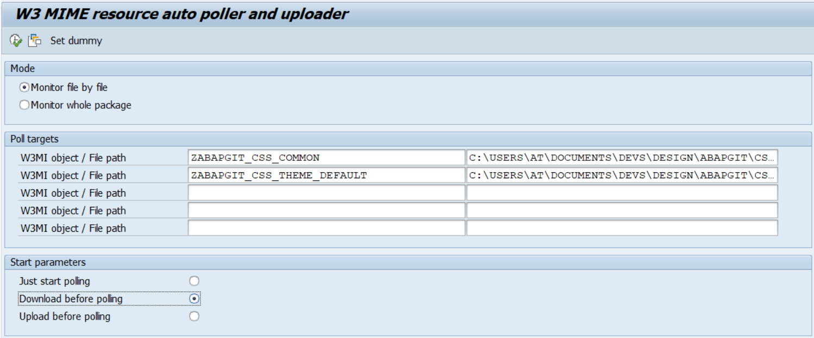
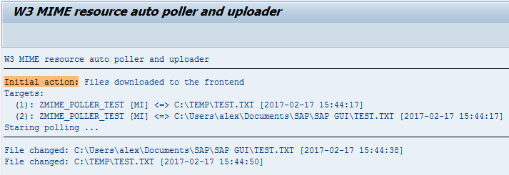
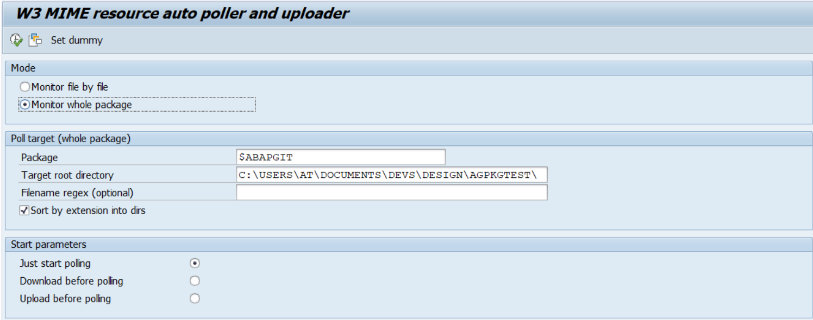
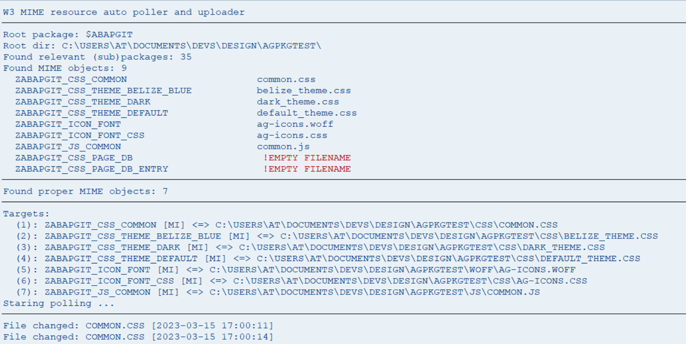

# ABAP W3MI poller

A tool to poll file changes and upload changed files automatically as W3MI objects.
Created mainly to simplify CSS editing in [abapGit](https://github.com/abapGit/abapGit), but can be used for other purposes.

## Installation

Clone the repository to your SAP system using [abapGit](https://github.com/abapGit/abapGit).

## Usage

### File-by-File polling

Enter filenames to poll and target objects at the selection screen. You can also one of many pairs. The first pair is remembered in user parameters for the session live time (`ZW3MIMEPOLL_FILE` / `ZW3MIMEPOLL_OBJ`).

Optionally, choose if you want to upload the file to SAP or replace the frontend file before the polling start.

### Whole package polling

Enter package to poll and a root directory to save files to. The program will automatically detect all sub-packages, find all W3MI object and start tracking them. Importantly, W3MI object metadata must contain a filename (it will be used to match objects and files in directory).

- As with the file-by-file mode you can choose an initial action to download or upload files once at start.
- Additionally, you can specify a regex to narrow down the file list (it is abap regex, so it's quite limited ... but still can be of use)
- You can also use "Sort by extension into dirs" option. In this mode, the program will order files by their extensions (must be a part of W3MI metadata !), create respecting subdirectories and put the files in there (e.g. all `.css` files will go to `css` subdirectory )

[A small video demo](img/demo.mp4)

## Use as library

The package contains several useful routines grouped into classes. All routines are static methods. Some of them may raise `zcx_w3mime_error` exception (use `get_text` to get some description of an error). For more details see implementations directly - the routines are mostly simple convenient wrappers over existing SAP calls. Can be used separately.

- zcl_w3mime_storage
  - `read_object(_x)` - read MIME object into raw255 table (or xstring)
  - `update_object(_x)` - save raw255 table (or xstring) as a MIME object (must exist already)
  - `choose_mime_dialog` - display dialog to choose MIME object. Can be used for F4 search helps. Filters only `Z` objects.
  - minor utils like `get_object_info` and `check_obj_exists`
- zcl_w3mime_fs
  - `choose_dir_dialog`, `choose_file_dialog` - quick wrappers around cl_gui_frontend methods.
  - `read_file(_x)`, `write_file(_x)` - quick wrapper to read/write a file, raw255 and xstring versions respectfully
  - `parse_path` - split path into directory, filename and extension
  - `resolve_filename` - split path into directory and filename, if no directory - fallback to SAP GUI default path
  - `path_join` - join 2 path parts e.g. directory and filename, respecting separators (but ignoring `..` at the moment)
  - `path_is_relative` - detects if one path is relative to the other (but ignoring `..` at the moment)
  - `path_relative` - calculates the difference between 2 paths (but ignoring `..` at the moment)
  - `path_ensure_dir_tail` - ensures dir ends with separator symbol
- zcl_w3mime_utils
  - `download` - save W3MIME object directly to file
  - `upload` - vice versa
- zcl_w3mime_poller
  - most complex wrapper. Polls directory (can be multiple) once per given period of time for file changes. If detected fires `changed` event with changed file list.
  - Usage: `construct` the object (this one is not static) giving the target list and timer interval, assign the event handler to `changed` (and to `error` optionally), `start` the poller.
  - see `zw3mimepoll` program if you are looking for an example. see `lcl_poller` class implementation - it contains concrete handling of a more abstract `zcl_w3mime_poller` tool
- zcl_w3mime_zip_writer
  - a wrapper around `cl_abap_zip`.
  - `has` - checks of the file exists in zip
  - `add(x), read(x)` - reads write data from zip, methods without `x` convert the data to string based on encoding specified during instantiation
  - `get_blob` - returns xstring of current zip state
  - `is_dirty` - tracks if there has been any changes since last `get_blob`. (`add` sets the flag, `get_blob` releases it).
